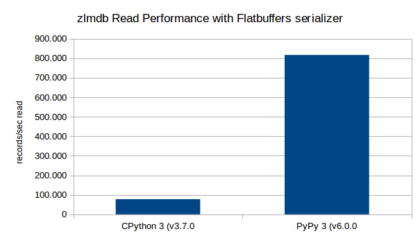
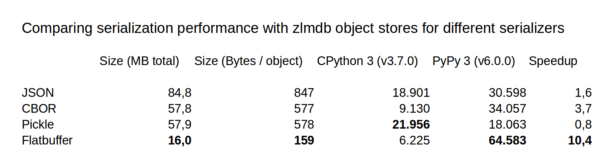

Performance
-----------

Read performance (with Flatbuffers serializer for object storage):

Write performance with different serializers:

* [zlmdb/tests/test_serialization.py](https://github.com/crossbario/zlmdb/blob/master/zlmdb/tests/test_serialization.py)
* [zlmdb/_pmap.py:_FlatBuffersValuesMixin](https://github.com/crossbario/zlmdb/blob/master/zlmdb/_pmap.py#L625)

Test system
...........

The test was run on an Intel NUC with Ubuntu Bionic:

.. code-block:: console

    (cpy370_1) oberstet@crossbar1:~/scm/crossbario/zlmdb$ uname -a
    Linux crossbar1 4.15.0-34-generic #37-Ubuntu SMP Mon Aug 27 15:21:48 UTC 2018 x86_64 x86_64 x86_64 GNU/Linux
    (cpy370_1) oberstet@crossbar1:~/scm/crossbario/zlmdb$ lsb_release -a
    No LSB modules are available.
    Distributor ID:	Ubuntu
    Description:	Ubuntu 18.04.1 LTS
    Release:	18.04
    Codename:	bionic
    (cpy370_1) oberstet@crossbar1:~/scm/crossbario/zlmdb$ lscpu
    Architektur:                   x86_64
    CPU Operationsmodus:           32-bit, 64-bit
    Byte-Reihenfolge:              Little Endian
    CPU(s):                        8
    Liste der Online-CPU(s):       0-7
    Thread(s) pro Kern:            2
    Kern(e) pro Socket:            4
    Sockel:                        1
    NUMA-Knoten:                   1
    Anbieterkennung:               GenuineIntel
    Prozessorfamilie:              6
    Modell:                        94
    Modellname:                    Intel(R) Core(TM) i7-6770HQ CPU @ 2.60GHz
    Stepping:                      3
    CPU MHz:                       900.102
    Maximale Taktfrequenz der CPU: 3500,0000
    Minimale Taktfrequenz der CPU: 800,0000
    BogoMIPS:                      5184.00
    Virtualisierung:               VT-x
    L1d Cache:                     32K
    L1i Cache:                     32K
    L2 Cache:                      256K
    L3 Cache:                      6144K
    NUMA-Knoten0 CPU(s):           0-7
    Markierungen:                  fpu vme de pse tsc msr pae mce cx8 apic sep mtrr pge mca cmov pat pse36 clflush dts acpi mmx fxsr sse sse2 ss ht tm pbe syscall nx pdpe1gb rdtscp lm constant_tsc art arch_perfmon pebs bts rep_good nopl xtopology nonstop_tsc cpuid aperfmperf tsc_known_freq pni pclmulqdq dtes64 monitor ds_cpl vmx est tm2 ssse3 sdbg fma cx16 xtpr pdcm pcid sse4_1 sse4_2 x2apic movbe popcnt tsc_deadline_timer aes xsave avx f16c rdrand lahf_lm abm 3dnowprefetch cpuid_fault epb invpcid_single pti ssbd ibrs ibpb stibp tpr_shadow vnmi flexpriority ept vpid fsgsbase tsc_adjust bmi1 hle avx2 smep bmi2 erms invpcid rtm mpx rdseed adx smap clflushopt intel_pt xsaveopt xsavec xgetbv1 xsaves dtherm ida arat pln pts hwp hwp_notify hwp_act_window hwp_epp flush_l1d

Results
.......

Fill & Read performance results for PyPy 3 (v6.0.0):

.. code-block:: console

    zlmdb/tests/test_flatbuffers.py::test_pmap_flatbuffers_count Using temporary directory /tmp/tmpg38791il for database
    Transaction ended: puts=10000 / dels=0 rows in 821 ms, 12166 rows/sec
    Transaction ended: puts=10000 / dels=0 rows in 211 ms, 47390 rows/sec
    Transaction ended: puts=10000 / dels=0 rows in 236 ms, 42372 rows/sec
    Transaction ended: puts=10000 / dels=0 rows in 216 ms, 46112 rows/sec
    Transaction ended: puts=10000 / dels=0 rows in 263 ms, 37881 rows/sec
    Transaction ended: 1000000 rows read in 1349 ms, 740900 rows/sec
    Transaction ended: 1000000 rows read in 1225 ms, 816188 rows/sec
    Transaction ended: 1000000 rows read in 1230 ms, 812895 rows/sec
    Transaction ended: 1000000 rows read in 1228 ms, 814307 rows/sec
    Transaction ended: 1000000 rows read in 1228 ms, 814307 rows/sec
    PASSED

and Write performance with different serializers:

.. code-block:: console

    zlmdb/tests/test_serialization.py::test_json_serialization_speed running on:
    3.5.3 (fdd60ed87e94, Apr 24 2018, 06:10:04)
    [PyPy 6.0.0 with GCC 6.2.0 20160901]
    uname_result(system='Linux', node='crossbar1', release='4.15.0-34-generic', version='#37-Ubuntu SMP Mon Aug 27 15:21:48 UTC 2018', machine='x86_64', processor='x86_64')
    19384.7 objects/sec 8.5 MB
    30204.7 objects/sec 17.0 MB
    30075.6 objects/sec 25.4 MB
    30390.1 objects/sec 33.9 MB
    27105.8 objects/sec 42.4 MB
    29900.0 objects/sec 50.9 MB
    30598.2 objects/sec 59.3 MB
    30044.7 objects/sec 67.8 MB
    30140.4 objects/sec 76.3 MB
    28741.3 objects/sec 84.8 MB
    30598.2 objects/sec max, 84.8 MB bytes total, 847 Bytes bytes/obj
    PASSED
    zlmdb/tests/test_serialization.py::test_cbor_serialization_speed running on:
    3.5.3 (fdd60ed87e94, Apr 24 2018, 06:10:04)
    [PyPy 6.0.0 with GCC 6.2.0 20160901]
    uname_result(system='Linux', node='crossbar1', release='4.15.0-34-generic', version='#37-Ubuntu SMP Mon Aug 27 15:21:48 UTC 2018', machine='x86_64', processor='x86_64')
    24692.3 objects/sec 5.8 MB
    32789.0 objects/sec 11.6 MB
    34056.9 objects/sec 17.3 MB
    32679.4 objects/sec 23.1 MB
    33207.5 objects/sec 28.9 MB
    33553.0 objects/sec 34.7 MB
    27443.7 objects/sec 40.4 MB
    31347.2 objects/sec 46.2 MB
    33560.1 objects/sec 52.0 MB
    33203.0 objects/sec 57.8 MB
    34056.9 objects/sec max, 57.8 MB bytes total, 577 Bytes bytes/obj
    PASSED
    zlmdb/tests/test_serialization.py::test_pickle_serialization_speed running on:
    3.5.3 (fdd60ed87e94, Apr 24 2018, 06:10:04)
    [PyPy 6.0.0 with GCC 6.2.0 20160901]
    uname_result(system='Linux', node='crossbar1', release='4.15.0-34-generic', version='#37-Ubuntu SMP Mon Aug 27 15:21:48 UTC 2018', machine='x86_64', processor='x86_64')
    16280.2 objects/sec 8.5 MB
    16985.4 objects/sec 17.0 MB
    17206.1 objects/sec 25.5 MB
    17056.9 objects/sec 34.0 MB
    17406.6 objects/sec 42.4 MB
    17474.5 objects/sec 50.9 MB
    17509.5 objects/sec 59.4 MB
    17450.8 objects/sec 67.9 MB
    18063.3 objects/sec 76.4 MB
    17343.1 objects/sec 84.9 MB
    18063.3 objects/sec max, 84.9 MB bytes total, 848 Bytes bytes/obj
    PASSED
    zlmdb/tests/test_serialization.py::test_flatbuffer_serialization_speed running on:
    3.5.3 (fdd60ed87e94, Apr 24 2018, 06:10:04)
    [PyPy 6.0.0 with GCC 6.2.0 20160901]
    uname_result(system='Linux', node='crossbar1', release='4.15.0-34-generic', version='#37-Ubuntu SMP Mon Aug 27 15:21:48 UTC 2018', machine='x86_64', processor='x86_64')
    58094.0 objects/sec 1.6 MB
    52665.7 objects/sec 3.2 MB
    63701.7 objects/sec 4.8 MB
    61753.9 objects/sec 6.4 MB
    63488.8 objects/sec 8.0 MB
    64583.2 objects/sec 9.6 MB
    62175.9 objects/sec 11.2 MB
    64443.8 objects/sec 12.8 MB
    63375.5 objects/sec 14.4 MB
    61808.2 objects/sec 16.0 MB
    64583.2 objects/sec max, 16.0 MB bytes total, 159 Bytes bytes/obj
    PASSED

Fill & Read performance results for CPython 3 (v3.7.0):

.. code-block:: console

    zlmdb/tests/test_flatbuffers.py::test_pmap_flatbuffers_count Using temporary directory /tmp/tmpkxt44ayp for database
    Transaction ended: puts=10000 / dels=0 rows in 1747 ms, 5721 rows/sec
    Transaction ended: puts=10000 / dels=0 rows in 1716 ms, 5826 rows/sec
    Transaction ended: puts=10000 / dels=0 rows in 1752 ms, 5705 rows/sec
    Transaction ended: puts=10000 / dels=0 rows in 1742 ms, 5740 rows/sec
    Transaction ended: puts=10000 / dels=0 rows in 1756 ms, 5692 rows/sec
    Transaction ended: 1000000 rows read in 12931 ms, 77328 rows/sec
    Transaction ended: 1000000 rows read in 12926 ms, 77361 rows/sec
    Transaction ended: 1000000 rows read in 12956 ms, 77179 rows/sec
    Transaction ended: 1000000 rows read in 12977 ms, 77056 rows/sec
    Transaction ended: 1000000 rows read in 12860 ms, 77758 rows/sec
    PASSED

and Write performance with different serializers:

.. code-block:: console

    zlmdb/tests/test_serialization.py::test_json_serialization_speed running on:
    3.7.0 (default, Sep 11 2018, 09:56:32)
    [GCC 7.3.0]
    uname_result(system='Linux', node='crossbar1', release='4.15.0-34-generic', version='#37-Ubuntu SMP Mon Aug 27 15:21:48 UTC 2018', machine='x86_64', processor='x86_64')
    18612.4 objects/sec 8.5 MB
    17952.2 objects/sec 17.0 MB
    18716.1 objects/sec 25.4 MB
    18239.6 objects/sec 33.9 MB
    18900.9 objects/sec 42.4 MB
    18328.9 objects/sec 50.9 MB
    18454.4 objects/sec 59.3 MB
    18544.6 objects/sec 67.8 MB
    18553.5 objects/sec 76.3 MB
    18304.3 objects/sec 84.8 MB
    18900.9 objects/sec max, 84.8 MB bytes total, 847 Bytes bytes/obj
    PASSED
    zlmdb/tests/test_serialization.py::test_cbor_serialization_speed running on:
    3.7.0 (default, Sep 11 2018, 09:56:32)
    [GCC 7.3.0]
    uname_result(system='Linux', node='crossbar1', release='4.15.0-34-generic', version='#37-Ubuntu SMP Mon Aug 27 15:21:48 UTC 2018', machine='x86_64', processor='x86_64')
    9066.4 objects/sec 5.8 MB
    9125.0 objects/sec 11.6 MB
    9063.7 objects/sec 17.3 MB
    9108.3 objects/sec 23.1 MB
    8998.3 objects/sec 28.9 MB
    8938.6 objects/sec 34.7 MB
    9088.6 objects/sec 40.4 MB
    9063.0 objects/sec 46.2 MB
    9127.8 objects/sec 52.0 MB
    9129.6 objects/sec 57.8 MB
    9129.6 objects/sec max, 57.8 MB bytes total, 577 Bytes bytes/obj
    PASSED
    zlmdb/tests/test_serialization.py::test_pickle_serialization_speed running on:
    3.7.0 (default, Sep 11 2018, 09:56:32)
    [GCC 7.3.0]
    uname_result(system='Linux', node='crossbar1', release='4.15.0-34-generic', version='#37-Ubuntu SMP Mon Aug 27 15:21:48 UTC 2018', machine='x86_64', processor='x86_64')
    21894.9 objects/sec 5.8 MB
    21725.4 objects/sec 11.6 MB
    21793.6 objects/sec 17.4 MB
    21755.0 objects/sec 23.2 MB
    21873.5 objects/sec 28.9 MB
    21651.3 objects/sec 34.7 MB
    21620.2 objects/sec 40.5 MB
    21810.5 objects/sec 46.3 MB
    21956.2 objects/sec 52.1 MB
    21133.8 objects/sec 57.9 MB
    21956.2 objects/sec max, 57.9 MB bytes total, 578 Bytes bytes/obj
    PASSED
    zlmdb/tests/test_serialization.py::test_flatbuffer_serialization_speed running on:
    3.7.0 (default, Sep 11 2018, 09:56:32)
    [GCC 7.3.0]
    uname_result(system='Linux', node='crossbar1', release='4.15.0-34-generic', version='#37-Ubuntu SMP Mon Aug 27 15:21:48 UTC 2018', machine='x86_64', processor='x86_64')
    6127.6 objects/sec 1.6 MB
    6176.0 objects/sec 3.2 MB
    6171.0 objects/sec 4.8 MB
    6194.4 objects/sec 6.4 MB
    6191.5 objects/sec 8.0 MB
    6225.2 objects/sec 9.6 MB
    6144.9 objects/sec 11.2 MB
    6175.1 objects/sec 12.8 MB
    6118.0 objects/sec 14.4 MB
    6119.6 objects/sec 16.0 MB
    6225.2 objects/sec max, 16.0 MB bytes total, 159 Bytes bytes/obj
    PASSED
